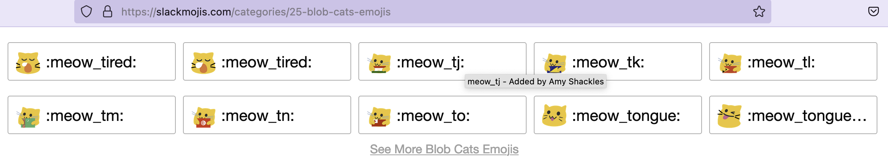
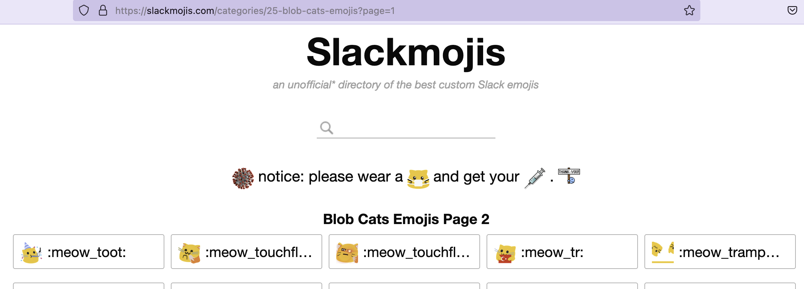
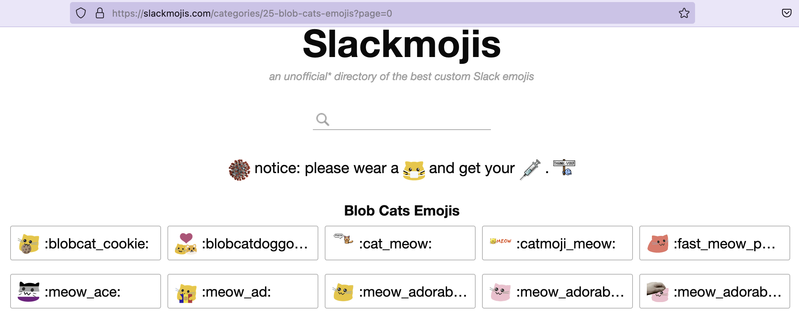
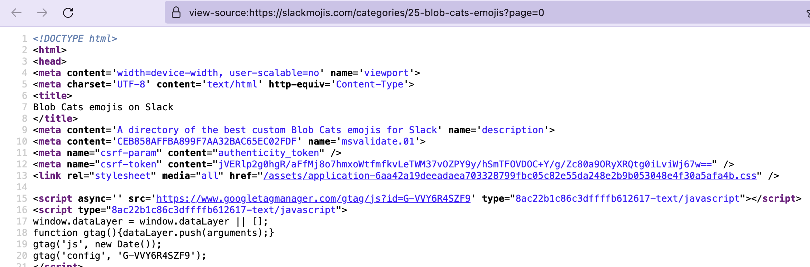
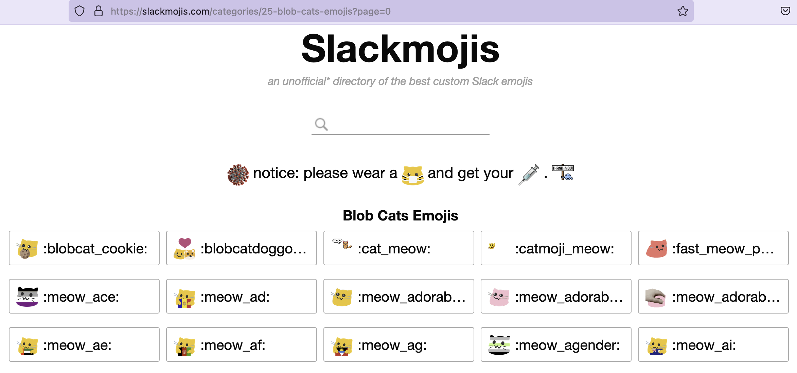
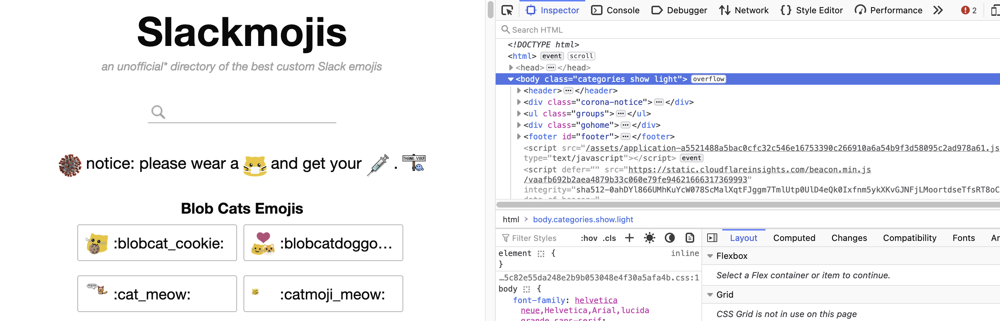
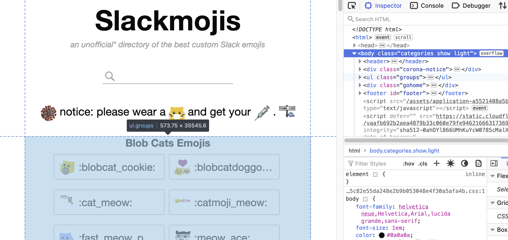
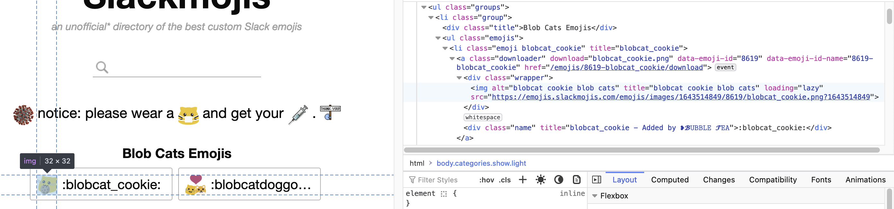
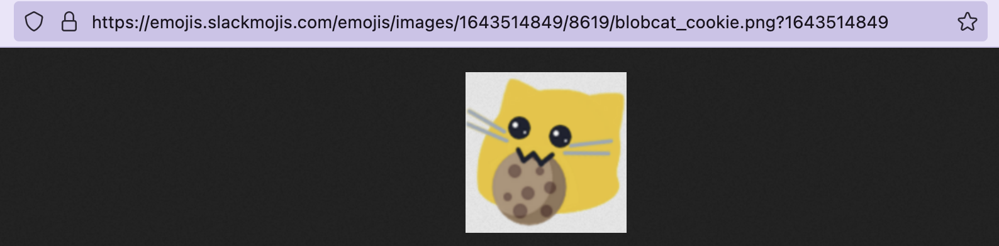
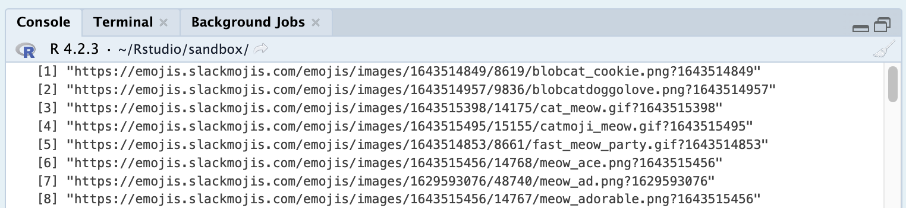

+++
author = "Kean Rawr"
title = "Scrape emojis for slack"
date = "2023-03-19"
description = "Using R and rvest to scrape emojis for your slack workspace"
tags = [
    "r",
    "web scraping",
    "slack",
    "emojis"
]
image = "banner.jpg"
+++

# Why do this?

One of the most common pieces of advice that data science newbies get is to learn web scraping, this is usually acompanied by an argument like: "WS is a really important skill for data science, since being able to scrape your own dataset from the web comes in handy".

As a person who dives head first into anything that's deemed "highly valuable" I went head first into learning web scraping. However, after years in my data science journey, rarely have I had to scrape my own datasets. And this is to be expected, most companies can't even handle the amount of existing data they have at hand, or wouldn't mind paying for some API service or data broker to provide additional datasets.

This doesn't mean I think learning web scraping isn't useful, on the contrary, I find WS to be important, but not because you'll have to scrape your datasets. I think that WS is one of the easiest ways to dip your toe into how the web works. As a data scientist you'll eventually find yourself in contact with some form of web service, it could be some endpoint from your company, or a third-party vendor, that provides some data you need, or when putting some model in production. Regardless of the way, shape or form that this interactions comes, knowing your way around what terms like "request", "authentication" or "body" mean, will make these much easier.

The previous being said, we'll go through a simple and fun use case that serves as a light introduction to WS, and as a side effect provides you with a bunch of emojis for your slack workspace!

## What is web scraping?

There have been many blog posts written on the meaning of WS, so I won't waste too much time defining it.

Web scraping is the process of requesting a web page containing data you're interested in, and parsing out said information for some purpose, e.g., downstream processing, or running a text analysis.

## What we'll be doing

We'll be using the [rvest](https://rvest.tidyverse.org/) R package to scrape [slackmojis.com](https://slackmojis.com) for the [blob cats category](https://slackmojis.com/categories/25-blob-cats-emojis). My employer's slack workspace is lacking on some meow action. We'll be following these rough steps:

1. Identify the target URL(s)
2. Identify the selector to the emojis
3. Save the emojis locally
4. (Optional) Add them to a slack workspace

To follow along you'll need:

- A working installation of R
- The `rvest` and `stringr` R packages
- (Optionally) the Rstudio IDE
- A browser with developer tools (e.g., Chrome, Firefox, Edge, Brave)

## Idetify the target URL(s)

This one's kind of a freebie right? We already said that we'll be scraping [https://slackmojis.com/categories/25-blob-cats-emojis](https://slackmojis.com/categories/25-blob-cats-emojis) for meow emojis right? Well, we can still do a little more. If we look closely at the page, there's a "See More Blob Cats Emojis" button.

If we click it we are taken to a page with more emojis, looking at the address bar we notice that it's essentially the same address as before, only with some extra characters: `?page=1`. This is called a **query string**, and it's something that we use to tell a web application more about the content we're requesting through some parameters and values, the page number in this case.

Query parameters are specified in the query string, we use the `?` character to separate the URL from the query string. The structure of a query string follows this format: `param1=value1&param2=value2&...`.

> 📝 This is a very simple example where we aren't encoding special characters like a whitespace or a question mark in the parameters or values from our query string.

Why is this useful? well, first of all, you're welcome for some useful knowledge. Second, in cases like this we can leverage this information to make our WS adventure easier.

Each emoji page contains a 200x5 grid, with this many emojis per page we only need two pages to get all the images we're interested in, something we can manually handle, but imagine that each page contained only 10 emojis, if that were the case, changing the url manually would be really annoying. Let's play with our query parameter, if we set `page=0` and hit "go" in our browser we get...

The first page! Now we know that we have the ability to programmatically iterate through these pages. This may not be very useful for this particular case, but it might come in handy in other cases.

Now that we've identified what our target URLs look like we can write some initial R code to catch this behavior.

## Identify the selector to the emojis

I like to think that selectors are the cornerstone of web scraping, it's how we tell rverst (or any other WS framework) what elements of the page we actually want. To give a brief explanation on what selectors are it's worth exploring what a web page is.

All web pages are HTML under the hood, Whenever you visit a web page your browser parses the raw HTML, and with the help of [CSS](https://en.wikipedia.org/wiki/CSS) and [JavaScript](https://en.wikipedia.org/wiki/JavaScript) turns it into whatever's in front of you. You might've entered "source mode" by accident at one point, since most chromium-based browsers like chrome or modern edge, have this capability.

Even though we can use the source code version to find what we need, that's somewhat of a pain, we'd need to have the ability to stare at a wall of symbols and parse it in our heads, like Neo and his friends do in the Matrix movies. Fortunately for us, our browser provides us with the **developer tools**. It might be different depending your browser, but in general you can access the developer tools using the `F12` button in your keyboard.

With our handy developer tools we can go ahead and find our selector. First of all, you'll want to be in the "Inspector" tab of your developer tools. Now, if we hover over some of the HTML we'll see the corresponding content get highlighted on the page.

We can see that the's some funny looking stuff like `<ul class="groups">`, these things are called tags, and they're the building blocks of an HTML document, if you've ever seen an XML file these will look familiar. Tags can be nested, and in this case that's what we're seeing. Tags can have attributes, some tags have required attributes to do their thing, and some attributes can be part of any tag, the `class` and `id` attributes are examples of this, these attributes have special selector characters, prefixing a class with a dot (e.g., `.my-class`) selects all tags with the `my-class` class, to select a tag using its `id` attribute simple use `#` as a prefix. Classes applied to a tag are separated by spaces.

Now, like modern computer-savy Hansel and Grettel we'll follow the HTML tags breadcrumbs to what we need. If we unnest tags following the trail to the first emoji we'll get to this:

We've found some interesting stuff here, apparently there are classes like "emojis" and "downloader" that can be used to target a single emoji. What we're intesrested in is in the `img` tag, which has the `src` attribute, this attribute is used to specify the URL to the actual image. If we copy the `src` value and pase it on the address bar we get this:

Alright! Now that we know what we need let's code it up. We'll be using the `read_html` function to read the page, `html_elements` to extract elements using selectors, and `html_attr` to extract the emoji url.

If we execute this code snippet we can verify the result we're getting is what's expected.

> 📝 We could also leverage a browser extension like [CSS selector](https://chrome.google.com/webstore/detail/css-selector/dobcgekgcmhjmfahepgbpmiaejlpaalc?hl=en), but I find them to be redundant. There are cases when your target might be so complex that using an extension to find the correct selector is beneficial, but in my experience, those cases are the exceptions rather than the rule

## Save the emojis locally

The only missing puzzle piece is a way to save our emoji files locally. Fortunatelly for us, R has a built-in `download.file` method that we can use. This method only requires the URL and the destination for the file to be saved, we already have the URLs, we now need to define the destination. Since I'm really bad at regex and R's regex support doesn't make it any easier for me, we'll use the `stringr` package.

Now we can put everything together!

And that's it! With less than 30 lines of R code we were able to download a bunch of meow emojis that are ready to be dropped in some slack converstations with my coworkers.

## (Optional) Add them to a slack workspace

Once we have all our files downloaded we can add them to our slack workspace. Slack doesn't provide support for bulk uploads out of the box, but we can use the [Neutral Face Emoji Tools](https://chrome.google.com/webstore/detail/neutral-face-emoji-tools/anchoacphlfbdomdlomnbbfhcmcdmjej) browser extension to help with that. If you're going to be using the extension, I recommend to not upload more than 20 emojis at a time, or you'll hit a limit on the number of emojis to upload. Any emojis that don't go through, can be easily identified and retry to upload.

## Final thoughs

Hope this small tutorial helps anyone other than future me for reference on downloading emoji packs. I'm working on putting together a more complex use case of WS to scrape a dataset to use in an actual analysis. Until then, see you around.
